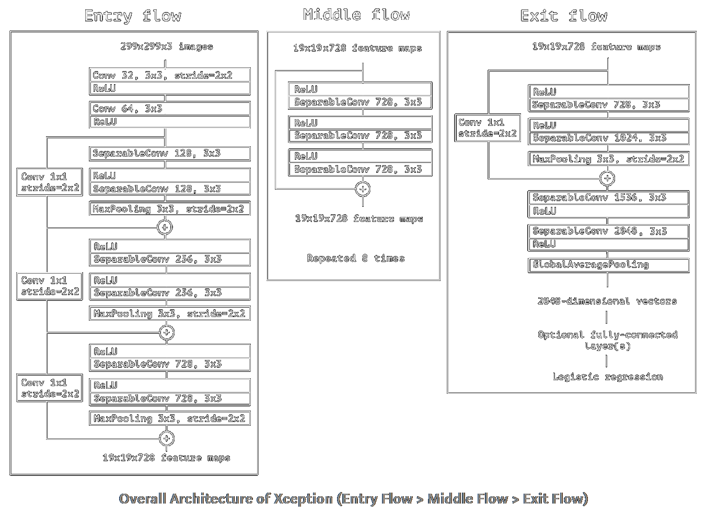

# Cop Detection
This is an example of using the **TrackEverything** package, you can find instructions on installation and other explanations [here](https://github.com/ami-a/TrackEverything).

## Overview

### The Detection Model
In this example I used the base of [this](https://github.com/tensorflow/models/tree/master/research/object_detection) Object Detection API(I modified the version for TF1 since the TF2 version only came out later). This model is trained on the [COCO dataset](http://cocodataset.org/) which detects around 90 different objects, you can choose [here](https://github.com/tensorflow/models/blob/master/research/object_detection/g3doc/tf1_detection_zoo.md) some models with different CNN architectures. In the `custom_get_detection_array` I used the model to give me all the persons detected in a frame with a score of at least `DETECTION_THRESHOLD=0.5`. Later I filter out redundant overlapping detections using the default Non-maximum Suppression (NMS) method.

### The Classification Model
After we have the persons from the detection model, I put them through a classification model to determine the probability of them being a cop. I used the `Xception` CNN architecture with some added layers to train this model, I used this architecture for its low parameters count since my GPU does not have much to offer. 

Then, we create our `Detections` object list and which contains the positions boxes and the classification data.

